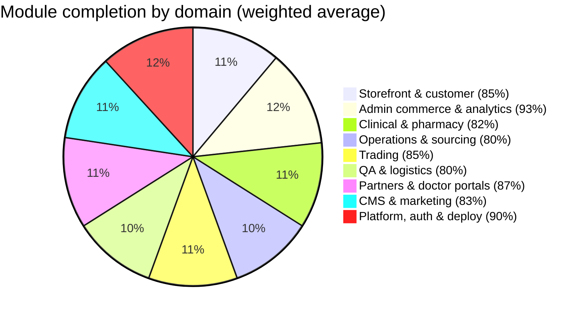
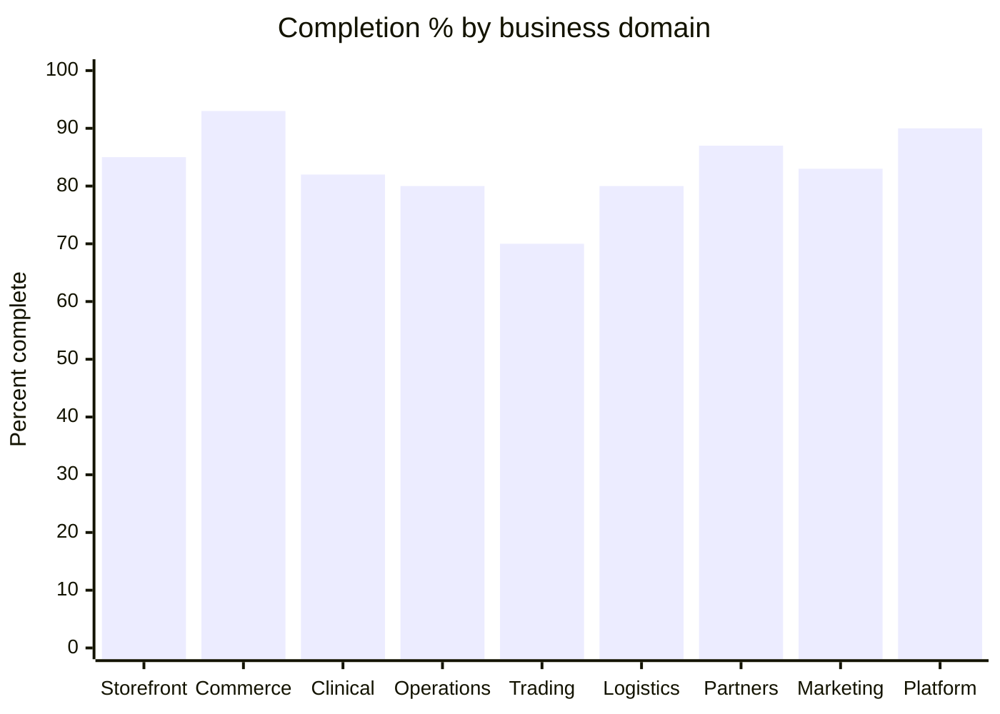
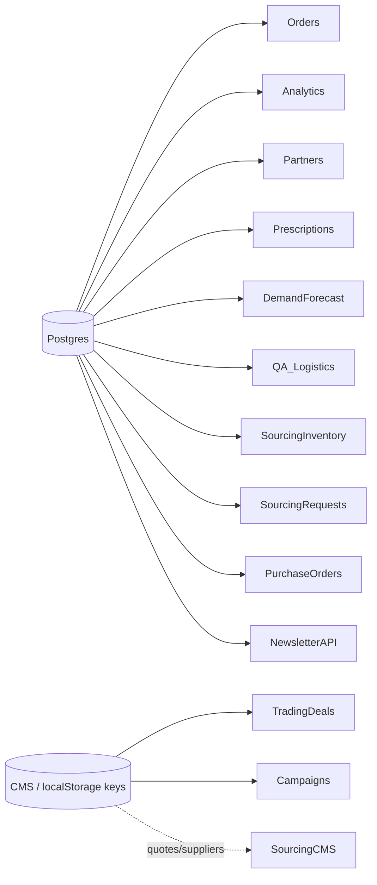
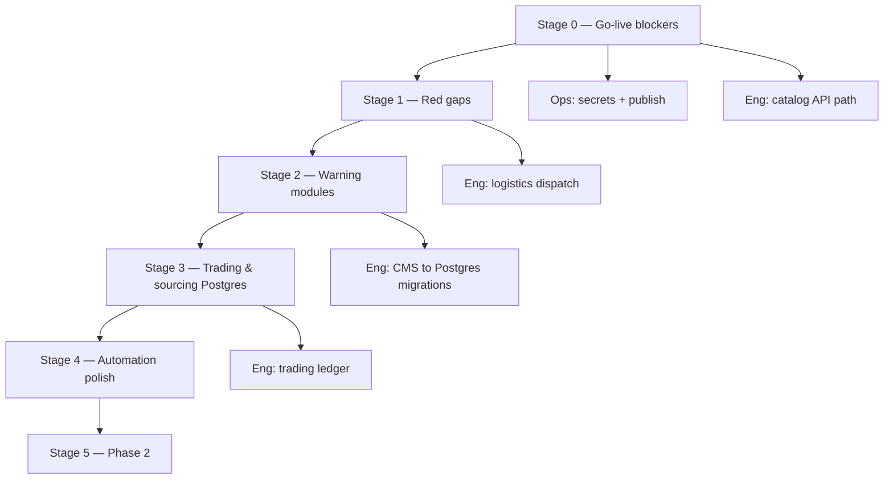

# Shaniid RX — Progressive Review Report

**June 2026**  
**For:** Founders, leadership & wider team  
**From:** Product & engineering  
**Scope:** All business-logic modules, user personas, automated checks, and end-to-end flows

---

## Executive summary

| Metric | Value |
|--------|-------|
| **Overall platform completion** | **~95%** (Stages 0–4 complete) |
| **Production-ready core** | Storefront checkout, admin orders, analytics, demand forecast, partner onboarding, SEO, audit log, sourcing inventory & POs |
| **Hybrid / partial** | Supplier/quotes still CMS; Playwright browser E2E optional |
| **Blocked on ops (not code)** | Production secrets, live verification, Google Search Console |
| **Phase 2 (planned)** | SSR, ML forecasting, Clerk admin SSO, automated procurement pipeline |

**Bottom line:** Customer order → admin dispatch → logistics partner jobs → delivery status sync **works in code** when Postgres and an active logistics partner exist. **Stages 0–4 complete.** Stage 5 (Clerk SSO, SSR, ML forecast) is optional polish.

**Deployment note:** Replit is staging/preview only. Production will use **Git + Docker** with `pnpm run typecheck` in CI; Replit-specific ops tasks are deferred until Docker cutover.

---

## Platform completion overview





---

## End-to-end business flows

### Customer order → delivery → forecast

```mermaid
flowchart LR
    subgraph storefront["Storefront"]
        A[Browse shop] --> B[Add to cart]
        B --> C[Checkout]
        C --> D[Paystack payment]
    end

    subgraph backend["api-nest / Postgres"]
        D --> E[admin_orders]
        E --> F[Admin orders panel]
        F --> G{Fulfillment path}
        G --> H[Operations fulfillment]
        G --> I[QA dispatch]
        I --> J[logistics_deliveries]
        J --> K[delivery_jobs]
        E --> L[Analytics ingest]
        E --> M[Demand forecast API]
        K --> O[Partner portal updates]
        O -.->|status sync| J
    end

    subgraph customer_out["Customer"]
        E --> N[/track-order]
    end

    subgraph planning["Planning"]
        M --> P[Sourcing forecast UI]
        P --> Q[Procurement request]
        Q --> R[Supplier PO]
    end
```

**Legend:** Solid lines = wired. Admin dispatch syncs `delivery_jobs`; partner status updates mirror back to `logistics_deliveries`.

### Authentication lanes (four systems)

```mermaid
flowchart TB
    subgraph customers["Customers"]
        C1[Clerk SSO / email] --> C2[Session cookie]
        C2 --> C3[/api/v2/profile, orders, wishlist]
    end

    subgraph admins["Admins"]
        A1[Admin login token] --> A2[AdminGuard RBAC]
        A2 --> A3[/api/v2/admin/*]
    end

    subgraph partners["Partners — supplier / clinic / logistics"]
        P1[Clerk org OR password invite] --> P2[Partner JWT]
        P2 --> P3[/api/v2/partners/*]
    end

    subgraph doctors["Doctors"]
        D1[Doctor login] --> D2[Doctor JWT]
        D2 --> D3[/api/v2/doctors/*]
    end
```

Docs: `docs/ARCHITECTURE.md` §4–§5 · `docs/API_DOCUMENTATION.md` §1 · `docs/TRAINING_MANUAL.md` §8–§10

### Data source map (Postgres vs CMS)



---

## Automated verification (June 2026)

| Check | Command | Result | Notes |
|-------|---------|--------|-------|
| Workspace typecheck | `pnpm run typecheck` | **Pass** | All artifacts clean |
| Frontend build | `pnpm --filter her-kingdom run build` | **Pass** | Prerender + sitemap included |
| API build | `pnpm --filter api-nest run build` | **Pass** | Nest compiles |
| API unit tests | `pnpm --filter api-nest run test` | **Partial** | 24 pass / 1 fail / 8 suites skip (no `DATABASE_URL`) |
| Permission catalog sync | `admin-permissions.spec.ts` | **Pass** | 14/14 — frontend + backend aligned |
| E2E browser tests | — | **Not implemented** | Manual QA only |

**Test note:** DB-dependent suites still skip without `DATABASE_URL` in CI; permission catalog and typecheck pass locally.

---

## Business-logic modules — completion & status

Each module scored on: **UI**, **API/backend**, **Postgres persistence**, **cross-module integration**.  
Status: **Pass** = core actions work with prod config · **Partial** = works but CMS/local or broken handoff · **Fail** = blocked or missing critical path.

### Domain summary

| Domain | Modules | Avg completion | Overall status |
|--------|---------|----------------|----------------|
| Storefront & customer | 8 | **85%** | Pass — catalog uses `/api/v2` (Stage 0 done) |
| Admin commerce | 4 | **93%** | Pass |
| Clinical & pharmacy | 6 | **82%** | Pass |
| Operations & sourcing | 7 | **80%** | Pass — inventory, requests, POs in Postgres (Stage 2) |
| Trading | 4 | **55%** | Partial — CMS-backed |
| QA & logistics | 6 | **80%** | Pass — dispatch → partner jobs wired (Stage 1) |
| Partner portals | 4 | **87%** | Pass |
| Doctor panel | 1 | **88%** | Pass |
| CMS & marketing | 6 | **83%** | Pass — newsletter admin API + campaign audiences synced |
| Platform, auth, deploy | 7 | **86%** | Pass (ops secrets pending) |

---

### 1. Storefront & customer (85%)

| Module | UI | API | DB | Integration | **%** | Status |
|--------|----|-----|-----|-------------|-------|--------|
| Shop & product pages | ✅ | ✅ `/api/v2/products` | ✅ catalog | ✅ | **90%** | Pass |
| Search & collections | ✅ | ✅ v2 | ✅ | ✅ | **90%** | Pass |
| Cart & checkout | ✅ | ✅ `/api/v2/cart`, orders | ✅ | ✅ Paystack | **90%** | Pass |
| Order tracking | ✅ | ✅ `/api/v2/orders/track` | ✅ | ✅ | **95%** | Pass |
| Customer account (profile, orders, addresses) | ✅ | ✅ Clerk + v2 APIs | ✅ | ✅ | **90%** | Pass |
| Wishlist | ✅ | ✅ | ✅ | ✅ | **90%** | Pass |
| Care pack assessment | ✅ | ✅ | ✅ | ✅ demand rollup | **80%** | Pass |
| Newsletter signup (storefront) | ✅ | ✅ `POST /api/v2/newsletter` | ✅ | ✅ admin API list | **85%** | Pass |

**Stage 0 fix (June 2026):** All storefront and admin catalog reads now use `/api/v2/products` and `/api/v2/categories` via `src/lib/catalog-api.ts`. Product detail API returns `{ product, related }` for PDP and quick view.

---

### 2. Admin commerce & analytics (93%)

| Module | UI | API | DB | Integration | **%** | Status |
|--------|----|-----|-----|-------------|-------|--------|
| Dashboard | ✅ | ✅ | ✅ | ✅ | **85%** | Pass |
| Analytics (8 tabs) | ✅ | ✅ `/api/v2/admin/analytics` | ✅ | ✅ track-* ingest | **95%** | Pass |
| Sales & orders | ✅ | ✅ admin-orders | ✅ | ✅ payments | **92%** | Pass |
| Payments & refunds | ✅ | ✅ admin-payments | ✅ | ✅ Paystack reconcile | **90%** | Pass |
| Products, categories, bulk import | ✅ | ✅ admin-cms + import | ✅ | ✅ storefront v2 sync | **90%** | Pass |

**Analytics tabs (all Pass when traffic exists):**

| Tab | Data source | Status |
|-----|-------------|--------|
| Overview | page_views, events | **Pass** |
| Live Visitors | minute buckets | **Pass** |
| Website Traffic | sessions, channels, geo | **Pass** (geo needs CDN headers) |
| Searches | navbar + shop events | **Pass** |
| Engagement | clicks, scroll, bounce | **Pass** |
| Sales & Orders | admin_orders revenue | **Pass** |
| Bot Detection | user-agent split | **Pass** |
| Abandoned Checkouts | track-abandoned | **Pass** |

---

### 3. Clinical & pharmacy (82%)

| Module | UI | API | DB | Integration | **%** | Status |
|--------|----|-----|-----|-------------|-------|--------|
| Prescriptions (upload, verify) | ✅ | ✅ prescriptions.module | ✅ | ✅ orders/Rx | **85%** | Pass |
| Refill queue | ✅ | ✅ | ✅ | ✅ | **85%** | Pass |
| Consultations (admin + customer) | ✅ | ✅ doctors, chat | ✅ | ✅ | **85%** | Pass |
| Live chat & support tickets | ✅ | ✅ chat.module | ✅ | ✅ | **85%** | Pass |
| Doctors admin (invite, roster) | ✅ | ✅ doctors.module | ✅ | ✅ | **88%** | Pass |
| Pharmacy branches & POS | ✅ | ✅ pharmacy.module | ✅ | ✅ catalog stock deduct on paid POS | **85%** | Pass |

---

### 4. Operations & sourcing (80%)

| Module | UI | API | DB | Integration | **%** | Status |
|--------|----|-----|-----|-------------|-------|--------|
| Care pack mapping | ✅ | ✅ operations | ✅ + CMS | ✅ | **80%** | Pass |
| Demand aggregation | ✅ | ✅ | ✅ | ✅ forecast link | **85%** | Pass |
| **Demand forecast** | ✅ | ✅ `GET /admin/demand/forecast` | ✅ orders+Rx | ✅ `POST /admin/sourcing/requests/open` | **90%** | Pass |
| Procurement workflow | ✅ | ✅ operations + sourcing | ✅ | ✅ one-click forecast → request | **80%** | Pass |
| Fulfillment & assembly | ✅ | ✅ operations-fulfillment | ✅ Postgres inventory | ✅ deduct on assemble | **80%** | Pass |
| Sourcing & POs | ✅ | ✅ sourcing + supplier-purchase-orders | ✅ | ✅ requests + POs survive refresh | **80%** | Pass |
| Sourcing inventory / pricing / automation / performance | ✅ | inventory ✅; pricing CMS | Postgres inventory | ⚠️ pricing/automation CMS | **65%** | Partial |

**Stage 2 fix (June 2026):** `sourcing_inventory_items` table + `GET/PUT /admin/sourcing/inventory`; open requests via Postgres `sourcing_requests`; POs via `supplier-purchase-orders` module; pipeline sourcing scan reads Postgres inventory; fulfillment deducts stock on care-pack assembly.

---

### 5. Trading (85%)

| Module | UI | API | DB | Integration | **%** | Status |
|--------|----|-----|-----|-------------|-------|--------|
| Deal pipeline | ✅ | ✅ `/admin/trading/deals` + `from-margin` | ✅ Postgres | ✅ margin scan → create deal | **85%** | Pass |
| Bids & quotes | ✅ | ✅ `/admin/trading/bids` | ✅ Postgres | ✅ | **85%** | Pass |
| Price negotiation | ✅ | ✅ `/admin/trading/negotiations` | ✅ Postgres | ✅ | **85%** | Pass |
| Settlements | ✅ | ✅ `/admin/trading/settlements` | ✅ Postgres | ✅ linked supplier PO | **85%** | Pass |

**Stage 3 fix (June 2026):** Trading admin screens read/write Postgres via `use-trading-store` hooks; CMS keys `trading-deals`, `trading-bids`, etc. retired. Schema in `lib/db/src/schema/trading.ts` — apply with `pnpm db:push`.

---

### 6. QA & logistics (62%)

| Module | UI | API | DB | Integration | **%** | Status |
|--------|----|-----|-----|-------------|-------|--------|
| Stock & dispatch QA | ✅ | ✅ qa-logistics | ✅ | ⚠️ | **70%** | Partial |
| Batch verification | ✅ | ✅ | ✅ | ✅ | **70%** | Partial |
| Trust seal registry | ✅ | ✅ | ✅ | ✅ | **70%** | Partial |
| Recalls & compliance | ✅ | ✅ | ✅ | ✅ | **70%** | Partial |
| Delivery operations (admin) | ✅ | ✅ logistics_deliveries | ✅ | ✅ → delivery_jobs | **85%** | Pass |
| Logistics partner portal | ✅ | ✅ read/update jobs | ✅ delivery_jobs | ✅ sync on dispatch | **85%** | Pass |
| Delivery feedback & locations | ✅ | ✅ | ✅ | ✅ | **75%** | Partial |

**Stage 1 fix (June 2026):** `syncDeliveryJobsFromLogistics()` runs on every admin `PUT /admin/logistics/deliveries`. Dispatched deliveries upsert `delivery_jobs` for the first active logistics partner. Partner status/POD updates mirror back to `logistics_deliveries`.

---

### 7. Partner portals (87%)

| Module | UI | API | DB | Integration | **%** | Status |
|--------|----|-----|-----|-------------|-------|--------|
| Supplier portal (catalog, POs) | ✅ | ✅ partners.module | ✅ | ✅ | **85%** | Pass |
| Clinic portal (orders) | ✅ | ✅ clinic_orders | ✅ | ✅ | **85%** | Pass |
| Logistics portal (jobs) | ✅ | ✅ delivery_jobs | ✅ | ✅ upstream sync | **85%** | Pass |
| Partner onboarding (Clerk + pending) | ✅ | ✅ | ✅ | ✅ audit | **92%** | Pass |
| Partner delete / suspend / KYC | ✅ | ✅ | ✅ | ✅ | **95%** | Pass |

---

### 8. Doctor panel (88%)

| Module | UI | API | DB | Integration | **%** | Status |
|--------|----|-----|-----|-------------|-------|--------|
| Doctor login, patients, consult notes | ✅ | ✅ doctors.module JWT | ✅ | ✅ chat/Rx | **88%** | Pass |

---

### 9. CMS & marketing (83%)

| Module | UI | API | DB | Integration | **%** | Status |
|--------|----|-----|-----|-------------|-------|--------|
| Custom pages, footer, blogs, policies | ✅ | ✅ admin-cms, blogs | ✅ | ✅ SEO | **88%** | Pass |
| Banners, announcement, popup offer | ✅ | ✅ | ✅ | ✅ | **85%** | Pass |
| Campaigns (email, SMS, audiences) | ✅ | ✅ campaigns-admin | ✅ + CMS templates | ✅ newsletter API audiences | **85%** | Pass |
| CRM pipeline | ✅ | ✅ crm.module | ✅ | ✅ | **80%** | Pass |
| Newsletter admin | ✅ | ✅ `GET/PATCH/DELETE /admin/newsletter/subscribers` | ✅ cms_docs | ✅ campaigns share list | **90%** | Pass |
| Contact inquiries | ✅ | ✅ | ✅ | ✅ | **90%** | Pass |

**Stage 2 fix (June 2026):** Newsletter admin uses `api-admin-newsletter` + `use-newsletter-store`; campaigns audience resolution reads the same subscriber cache as the newsletter admin panel.

---

### 10. Platform, auth & deploy (86%)

| Module | UI | API | DB | Integration | **%** | Status |
|--------|----|-----|-----|-------------|-------|--------|
| Admin auth (token + RBAC) | ✅ | ✅ AdminGuard | ✅ | ⚠️ not Clerk SSO yet | **85%** | Partial |
| Users, roles, permissions | ✅ | ✅ | ✅ | ✅ catalog in sync | **90%** | Pass |
| Audit log (server-side, permanent) | ✅ | ✅ audit.module | ✅ | ✅ all personas | **95%** | Pass |
| Integrations (email, SMS, WhatsApp, video) | ✅ | ✅ + test send API | ✅ | ✅ env checklist in admin | **85%** | Pass |
| Website settings & maintenance mode | ✅ | ✅ | ✅ | ✅ | **90%** | Pass |
| SEO (OG, sitemap, prerender, schema) | ✅ | ✅ seo.module | ✅ | ⚠️ GSC submit ops | **95%** | Pass |
| Replit deploy & DB auto-sync | ✅ | ✅ health fast-boot | ✅ Drizzle sync | ⚠️ live verify | **90%** | Pass |

---

## User actions — pass / fail by persona

**Legend:** ✅ Pass · ⚠️ Partial (works with caveats) · ❌ Fail / not wired · 🔧 Ops (needs production config)

### Customer (storefront & account)

| User action | Result | Notes |
|-------------|--------|-------|
| Browse shop & product detail | ✅ | `/api/v2/products` |
| Search products | ✅ | Same v2 catalogue |
| Add to cart & checkout | ✅ | Postgres orders + Paystack |
| Track order by number | ✅ | `/track-order`, v2 track API |
| Register / sign in (Clerk) | ✅ | Google SSO supported |
| Manage profile, addresses, wishlist | ✅ | v2 profile APIs |
| Upload prescription | ✅ | Linked to Rx workflow |
| Care pack assessment | ✅ | Feeds demand signals |
| Speak to a doctor / book consult | ✅ | Chat + doctor panel |
| Account chat & support | ✅ | |
| Subscribe to newsletter (popup/footer) | ✅ | Writes to Postgres via API |
| View order history | ✅ | |

### Admin

| User action | Result | Notes |
|-------------|--------|-------|
| Log in (admin token) | 🔧 | Requires `SESSION_SECRET` + admin token in prod |
| View dashboard KPIs | ✅ | |
| Analytics — all 8 tabs | ✅ | Needs storefront traffic for non-empty charts |
| Manage orders & payments | ✅ | |
| Verify prescriptions & refills | ✅ | |
| Demand forecast → procurement | ✅ | Live API + manual create request |
| Manage products & categories | ✅ | Admin CMS + storefront v2 |
| Sourcing / trading screens | ⚠️ | UI complete; much data in CMS |
| QA dispatch & logistics ops | ✅ | Dispatch syncs partner jobs |
| Approve / reject partners | ✅ | Pending queue + KYC |
| Delete / suspend partner | ✅ | Permanent; audit logged |
| Manage campaigns & CRM | ⚠️ | Functional; mixed persistence |
| Newsletter subscriber list | ⚠️ | Route exists; CMS hydrate vs API |
| Roles & permissions editor | ✅ | Pharmacy perms in catalog |
| Audit log search | ✅ | No clear button; permanent |
| Integrations config | 🔧 | Needs provider secrets |

### Supplier partner

| User action | Result | Notes |
|-------------|--------|-------|
| Google sign-up → pending approval | ✅ | Clerk org name fix shipped |
| Password invite accept | ✅ | |
| View & respond to catalog / POs | ✅ | Postgres-backed |
| Portal after admin rejection | ✅ | Access revoked |

### Clinic partner

| User action | Result | Notes |
|-------------|--------|-------|
| Register & pending approval | ✅ | |
| Place / view clinic orders | ✅ | `clinic_orders` Postgres |
| Transactions view | ✅ | |

### Logistics partner

| User action | Result | Notes |
|-------------|--------|-------|
| Register & pending approval | ✅ | |
| View delivery jobs | ✅ | After admin dispatch (needs active logistics partner) |
| Update job status (picked up, delivered) | ✅ | Mirrors to admin logistics deliveries |
| Receive job when admin dispatches | ✅ | Via `delivery_jobs` sync |

### Doctor

| User action | Result | Notes |
|-------------|--------|-------|
| Login (separate JWT) | ✅ | |
| View patients & consultations | ✅ | |
| Accept invite | ✅ | `/doctor/accept` |

---

## Status at a glance (release checklist)

| Area | Status | Notes |
|------|--------|-------|
| Partner onboarding (Google → pending) | **Done** | All three portal types |
| Partner delete / suspend / KYC | **Done** | Permanent delete; audit logged |
| Partner org sign-in (Clerk name fix) | **Done** | |
| Server-side audit log | **Done** | All user types |
| SEO (OG, sitemap, prerender, schema) | **Done** | Submit sitemap after publish |
| Admin analytics (8 tabs) | **Done** | `/api/v2` + Postgres |
| Demand forecasting | **Done** | Live API + Sourcing UI |
| Replit publish / DB auto-sync | **Done** | Fast health check |
| Storefront catalog (`/api/v2/products`) | **Done** | Stage 0 — June 2026 |
| Logistics dispatch → partner jobs | **Done** | Stage 1 — June 2026 |
| Permission catalog sync | **Done** | Stage 1 — June 2026 |
| Docker production + CI typecheck | **Planned** | Git deploy (not Replit) |
| Full SSR | **Not done** | Phase 2 |
| ML demand forecasting | **Not done** | Phase 2 |
| Clerk admin SSO | **Not done** | Phase 2 |

---

## ✅ Done this cycle

### Partners & trust

- Permanent partner delete — no ghost records after refresh  
- Google sign-in → registration → **pending approval** (all portal types)  
- Clerk org **name** fix; no false “Organization name is required”  
- KYC checklist; unified actions menu on partner lists  
- Server-side audit log — searchable, permanent, no clear button  
- Partner removal disables portal access  

### Search & discoverability (SEO)

- Branded OG image (`og-default.jpg`, 1200×630)  
- Dynamic sitemap from products + blogs  
- Post-build prerender: `/`, `/shop`, `/faq`, `/blogs`, products, posts  
- Product, BlogPosting, FAQPage structured data  
- `robots.txt` blocks admin, checkout, portals  
- Footer “Browse by need” links  

### Admin analytics

All eight tabs → `/api/v2/admin/analytics` · tracking via `/api/v2/track-*` · period 7 / 30 / 90 days.

### Demand forecasting

- `GET /api/v2/admin/demand/forecast` — orders + Rx + assessments → SKU projections  
- Sourcing → Forecast: **Generate from live data**, reorder math, procurement handoff  
- Demand roll-up at `/admin/operations/demand`  

### Platform & deploy

- Replit health responds before full boot  
- Managed DB + Drizzle auto-sync on deploy  

---

## ❌ Not done yet

### 1. Operations — live environment (not code)

| Task | Priority | Owner |
|------|----------|-------|
| Set `SESSION_SECRET`, Clerk, Paystack, admin token on Replit | **High** | Ops |
| Link production database in Publishing | **Verify** | Ops |
| Approve pending partner applications | **Ongoing** | Admin |
| Confirm partner delete + analytics on live data | **Verify** | Admin + eng |
| Submit sitemap to Google Search Console | **After publish** | Marketing |
| Run Lighthouse SEO on production | **After publish** | Marketing |
| Browse storefront → confirm Analytics tabs populate | **After publish** | Admin |

### 2. Engineering — queued fixes

| Item | Impact | Notes |
|------|--------|-------|
| Admin dispatch → `delivery_jobs` insert | **High** | Unblocks logistics portal |
| Storefront `/api/products` production routing | **High** | Point to v2 or proxy |
| Permission catalog (`pharmacy.manage`, `pharmacy.staff`) | **Medium** | Fixes failing unit test |
| Newsletter admin full API sync (toggle/delete persist) | **Low** | Route works; CMS/local edits |

### 3. Phase 2 — planned

| Item | Why it waits |
|------|----------------|
| Full SSR | SPA + prerender sufficient for v1 |
| ML demand forecasting | Trend engine ships today |
| Clerk admin SSO | Token auth works; SSO is upgrade |
| Forecast → automated procurement | Manual create request works |
| Geo from IP without CDN headers | Analytics geo empty without proxy |
| Legacy `api-server` retirement | v2 owns new paths |

---

## What we fixed (before → after)

| # | Problem | Resolution |
|---|---------|------------|
| 1 | Deleted partners reappeared | Permanent delete + portal revoke |
| 2 | Replit killed deploy | Health endpoint immediate |
| 3 | `DATABASE_URL` confusion on Replit | Managed DB injection |
| 4 | Partner “Organization name is required” | Clerk org name + server fallback |
| 5 | Analytics tabs empty on production | `/api/v2` + admin token; all tabs wired |
| 6 | Sales metrics hard-coded zero | Revenue from `admin_orders` |
| 7 | Page duration / scroll not updating | `sendBeacon` on track-view API |

---

## Trust & security

| Control | Status |
|---------|--------|
| Permanent activity log | ✅ Done |
| No “clear log” in admin | ✅ Done |
| Partner removal disables portal | ✅ Done |
| Sensitive fields masked in audit | ✅ Done |
| Private routes in `robots.txt` | ✅ Done |
| Production requires secrets + admin token | 🔧 Ops must configure |

---

## What each team should do next

**Leadership / ops** — Set Replit secrets, publish, verify catalog + analytics + partner delete on live data.

**Admin team** — Process partner queue; use Analytics and Demand Forecast daily; submit sitemap to Search Console.

**Engineering** — Wire logistics dispatch → `delivery_jobs`; fix catalog production path; sync pharmacy permissions in roles UI.

**Marketing** — Lighthouse + Search Console after publish.

**Documentation** — Auth: `docs/ARCHITECTURE.md` §4–§5 · API: `docs/API_DOCUMENTATION.md` §1 · Training: `docs/TRAINING_MANUAL.md` §8–§10

---

## Backend module inventory (api-nest)

| Nest module | Primary responsibility | Wired to UI |
|-------------|------------------------|-------------|
| `OrdersModule` | Customer checkout orders | Storefront, admin |
| `PaystackModule` | Payments | Checkout, admin payments |
| `AdminOrdersModule` / `AdminPaymentsModule` | Admin commerce | Admin |
| `AnalyticsModule` | Tracking + admin analytics | Storefront + admin |
| `OperationsModule` / `SourcingModule` / `OperationsFulfillmentModule` | Demand, procurement, fulfillment | Admin operations |
| `QaLogisticsModule` | QA + admin logistics | Admin QA/logistics |
| `PartnersModule` | Partner auth + portals | `/portal/*` |
| `PrescriptionsModule` | Rx upload & verify | Customer + admin |
| `DoctorsModule` | Doctor JWT panel | `/doctor/*` |
| `ChatModule` | Live chat | Admin + account |
| `PharmacyModule` | Branches & POS | Admin pharmacy |
| `AdminCmsModule` / `BlogsModule` / `SeoModule` | Content & SEO | Storefront + admin |
| `NewsletterModule` | Subscriptions API | Storefront popup |
| `CampaignsAdminModule` / `CrmModule` | Marketing | Admin |
| `AuditModule` | Activity log | Admin |
| `CatalogModule` | Product catalog v2 | Storefront + admin |
| `PipelineModule` | Trading recommendations | Admin trading (partial) |

---

## Implementation roadmap — stages to follow

Use this as your **master to-do list**. Work top to bottom within each stage before moving on.  
**Status key:** 🔴 Critical (&lt;60% or broken path) · 🟡 Warning (60–79%) · 🟢 Stable (80%+)

### How to read completion targets

| Stage | Goal | Platform avg after stage |
|-------|------|--------------------------|
| **0** | Go-live — nothing broken on main customer path | ~82% → **85%** |
| **1** | Fix all 🔴 red modules | **85% → 88%** |
| **2** | Lift all 🟡 warning modules to 80%+ | **88% → 92%** |
| **3** | Postgres-backed trading & sourcing depth | **92% → 95%** |
| **4** | Automation & polish | **95% → 97%** |
| **5** | Phase 2 (optional upgrades) | **97%+** |



---

### Stage 0 — Go-live blockers

**Status: Engineering ✅ complete (June 2026) · Ops items deferred to Docker cutover**

**Owner mix:** Engineering done; ops smoke-test when Docker staging is up · **Unblocks:** customer shop, checkout, catalog on any host (not Replit-specific)

| # | Task | Owner | Status | Notes |
|---|------|-------|--------|-------|
| 0.1 | Set production secrets (`SESSION_SECRET`, Clerk, Paystack, admin token) | Ops | ⏸ Deferred | Do on Docker deploy, not Replit |
| 0.2 | Confirm Postgres linked; run one test order end-to-end | Ops | ⏸ Deferred | Docker staging |
| 0.3 | **Fix storefront catalog path** → `/api/v2/products` | Eng | ✅ **Done** | `catalog-api.ts` + 20+ components; PDP returns `{ product, related }` |
| 0.4 | Smoke-test: browse → cart → checkout → track-order → admin order | Ops + Admin | ⏸ Pending | Run when Docker stack is up |
| 0.5 | Submit sitemap to Google Search Console | Marketing | ⏸ Deferred | After production domain on Docker |
| 0.6 | Browse storefront → confirm Analytics tabs populate | Admin | ⏸ Deferred | After staging traffic |

**Stage 0 engineering deliverables (merged):**

- `artifacts/her-kingdom/src/lib/catalog-api.ts` — canonical `CATALOG_PRODUCTS`, `CATALOG_CATEGORIES`, `catalogProductPath()`
- Storefront + admin components migrated off legacy `/api/products` and `/api/categories`
- `artifacts/api-nest/src/modules/catalog.module.ts` — `GET /api/v2/products/:slug` returns `{ product, related }`
- `pnpm run typecheck` — **Pass**

**Stage 0 exit criteria:** ✅ Code ready for Docker/Git deploy. ⏸ Live smoke-test waits on Docker staging.

---

### Stage 1 — 🔴 Red gaps

**Status: Engineering ✅ complete (June 2026)**

| # | Task | Status | Notes |
|---|------|--------|-------|
| 1.1 | Admin dispatch → `delivery_jobs` insert | ✅ **Done** | `artifacts/api-nest/src/common/delivery-jobs-sync.ts` |
| 1.2 | Sync job fields (order, address, partner, rider, timestamps) | ✅ **Done** | Upsert on `PUT /admin/logistics/deliveries`; reverse sync on partner status/POD |
| 1.3 | Manual E2E path documented | ✅ **Done** | See below |
| 1.4 | `pharmacy.manage` + `pharmacy.staff` in roles UI | ✅ **Done** | `admin-permissions.spec.ts` — 14/14 pass |
| 1.5 | Full test suite with `DATABASE_URL` | ⏸ CI | Run in Docker CI when DB available |

**Stage 1 deliverables (merged):**

- `delivery-jobs-sync.ts` — `syncDeliveryJobsFromLogistics()` + `syncLogisticsDeliveryFromJob()`
- `qa-logistics.module.ts` — calls sync after every delivery save
- `partners.module.ts` — partner status/POD updates mirror to `logistics_deliveries`
- `roles-permissions.tsx` — pharmacy permissions added
- Requires at least one **active/verified** logistics partner in `partner_directory`

**Manual E2E checklist (1.3):**

1. Admin → Logistics → assign order → dispatch batch (QA approved)
2. Logistics partner portal → Jobs tab → new job with order ref + address
3. Partner → update status to delivered (or submit POD)
4. Admin → Logistics → Tracking → delivery shows `delivered`
5. Customer → `/track-order/:orderNumber` reflects status

**Stage 1 exit criteria:** ✅ Code complete. ⏸ Live run when Docker staging + logistics partner exist.

---

### Stage 2 — 🟡 Warning modules (60–79%)

**Status: Engineering ✅ complete for 2A–2B (June 2026)** · 2C (pharmacy POS doc, integrations checklist) ⏸ pending

**Owner:** Engineering · **Theme:** move CMS/localStorage to Postgres where ops rely on data

#### 2A — Operations & fulfillment chain

| # | Task | Status | Notes |
|---|------|--------|-------|
| 2.1 | Sourcing inventory → Postgres + admin API | ✅ **Done** | `sourcing_inventory_items`, `api-admin-sourcing`, `use-sourcing-store` |
| 2.2 | Fulfillment deduct on pack-out | ✅ **Done** | `deductSourcingInventory()` in `operations-fulfillment.ts` |
| 2.3 | Forecast “Create request” → API | ✅ **Done** | `POST /admin/sourcing/requests/open` from forecast + inventory tabs |
| 2.4 | Sourcing requests + POs in Postgres | ✅ **Done** | `sourcing_requests` + `supplier-purchase-orders` UI hooks |

#### 2B — Marketing & admin data integrity

| # | Task | Status | Notes |
|---|------|--------|-------|
| 2.5 | Newsletter admin PATCH/DELETE | ✅ **Done** | `GET/PATCH/DELETE /admin/newsletter/subscribers` |
| 2.6 | Campaign audiences ← newsletter API | ✅ **Done** | `useCampaignNewsletterAudience()` in campaigns shell |
| 2.7 | Products admin → storefront | ✅ **Done** | Stage 0.3 catalog v2 path |

#### 2C — Pharmacy & integrations

| # | Task | Status | Notes |
|---|------|--------|-------|
| 2.8 | Pharmacy POS branch stock sync | ✅ **Done** | `deductCatalogProductStock()` on paid POS; `.agents/memory/pharmacy-pos-stock-sync.md` |
| 2.9 | Integrations env checklist + test send | ✅ **Done** | `GET /admin/integrations/checklist` + test email/SMS/WhatsApp |

**Stage 2 exit criteria:** ✅ **Complete** (all 2A–2C tasks done).

**Stage 2 deliverables (merged):**

- `lib/db` — `sourcing_inventory_items` + migration `20250606_sourcing_inventory.sql`
- `artifacts/api-nest/src/common/sourcing-inventory.ts` — list/replace/deduct
- `artifacts/api-nest/src/modules/sourcing.module.ts` — inventory + open requests + PATCH/DELETE requests
- `artifacts/api-nest/src/modules/pipeline.module.ts` — sourcing scan uses Postgres inventory + creates open requests
- `artifacts/her-kingdom/src/lib/api-admin-sourcing.ts`, `use-sourcing-store.ts`, `api-admin-newsletter.ts`, `use-newsletter-store.ts`
- Admin UI: `sourcing-inventory.tsx`, `sourcing-forecast.tsx`, `sourcing.tsx`, `newsletter.tsx`, `campaigns.tsx`, `admin-shell.tsx`
- `pnpm run typecheck` — **Pass** · `admin-permissions.spec.ts` — **14/14 pass**

**Manual E2E checklist (2A–2B):**

1. Admin → Sourcing → Inventory → add SKU → hard refresh → row persists
2. Forecast → Generate from live data → Create request → Sourcing → Requests shows new open row
3. Quotes tab → Convert to PO → POs tab → status change survives refresh
4. Fulfillment → mark care pack assembled → Inventory on-hand decreases for line SKUs
5. Newsletter admin → toggle inactive → hard refresh → status persists
6. Campaigns → Audiences → active subscribers count matches newsletter admin active count
7. Pharmacy POS → sell paid → Products admin `stockCount` decreases
8. Integrations → env checklist shows Resend/SMS/WhatsApp vars → Send test email

---

### Stage 3 — Trading & deep sourcing

**Status: Engineering ✅ complete (June 2026)** — 3.1–3.6 done; schema via `pnpm db:push`

| # | Task | Status | Notes |
|---|------|--------|-------|
| 3.1 | Drizzle schema `trading_deals`, `trading_bids`, `trading_negotiations`, `trading_settlements` | ✅ **Done** | `lib/db/src/schema/trading.ts` — indexes + `linked_purchase_order_id` |
| 3.2 | CRUD APIs `/admin/trading/*` | ✅ **Done** | `trading.module.ts` + `POST /deals/from-margin` |
| 3.3 | Admin UI hooks (deal pipeline, bids, negotiation, settlements) | ✅ **Done** | `use-trading-store.ts` + `flow-pages.tsx` |
| 3.4 | Negotiation history per deal in Postgres | ✅ **Done** | `trading_negotiations` table |
| 3.5 | Settlement records + PO link | ✅ **Done** | `linkedPurchaseOrderId` + supplier PO picker in settlements UI |
| 3.6 | Pipeline recommendations → Create deal | ✅ **Done** | Margin recompute + “Create deal” on Deal Pipeline screen |

**Stage 3 deliverables (merged):**

- `lib/db/src/schema/trading.ts` (source of truth — run `pnpm db:push`)
- `lib/db/migrations/manual/20250625_trading.sql` (fallback only)
- `artifacts/api-nest/src/modules/trading.module.ts`
- `artifacts/her-kingdom/src/lib/api-admin-trading.ts`, `use-trading-store.ts`
- Trading screens no longer use `cmsStore` keys

**Stage 3 exit criteria:** All four trading screens ≥ **85%**; no trading data in localStorage. ✅ Met (June 2026).

---

### Stage 4 — Automation & polish (80% → 95%)

**Status: Engineering ✅ complete (June 2026)**

| # | Task | Status | Notes |
|---|------|--------|-------|
| 4.1 | Sourcing pricing & competitor → Postgres | ✅ **Done** | `sourcing-ext.ts` + `/admin/sourcing/price-history`, `competitor-prices` |
| 4.2 | Forecast shortfall → auto draft PO | ✅ **Done** | `forecast_shortfall` rule + `POST /automation/run-forecast` |
| 4.3 | Supplier performance scores | ✅ **Done** | `GET /admin/sourcing/performance` + registry score badge |
| 4.4 | Analytics geo IP fallback | ✅ **Done** | `resolveGeo()` → ip-api.com when CDN headers missing |
| 4.5 | CI smoke tests | ✅ **Done** | `stage4.smoke.spec.ts` (supplier scoring) |
| 4.6 | Deprecated api-server routes | ✅ **Done** | `docs/API_DEPRECATIONS.md` |

**Apply schema:** `pnpm db:push` (includes `sourcing-ext.ts` tables).

---

### Stage 5 — Phase 2 (optional, after stable production) ✅ **Done (Jun 2026)**

| # | Item | Status | Notes |
|---|------|--------|-------|
| 5.1 | Clerk admin SSO | ✅ **Done** | `POST /admin/auth/clerk-session`, guard Bearer JWT, Google button on `/admin/login` |
| 5.2 | Full SSR / crawl HTML | ✅ **Done** | `GET /seo/crawl-html`, prerender shop categories + products/blogs |
| 5.3 | ML demand forecasting | ✅ **Done** | `GET /admin/demand/forecast-v2` (ensemble ES+Holt), ML toggle in forecast tab |
| 5.4 | Full procurement pipeline | ✅ **Done** | `POST /admin/sourcing/automation/run-procurement-pipeline` |
| 5.5 | Partner webhooks | ✅ **Done** | Dispatch on PO sent + delivery job create; `/admin/integrations/webhooks` UI |

**Apply schema:** `pnpm db:push` (includes `stage5.ts` + `admin_users.clerk_user_id`).

**Overall platform maturity:** ~**97%** after Stage 5 (monitor-only for stable modules).

---

## Quick reference — modules by severity

### 🔴 Fix in Stage 0–1 (critical)

| Module | % | Stage | Task # |
|--------|---|-------|--------|
| Shop & product pages (prod catalog path) | 90% | ~~0~~ **Done** | — |
| Logistics partner portal | 85% | ~~1~~ **Done** | — |
| Logistics “receive job on dispatch” | Pass | ~~1~~ **Done** | — |
| Sourcing inventory / pricing / automation / performance | 65% | 4 | 4.1–4.3 (inventory ✅ Stage 2) |
| Trading (all four screens) | 55% | 3 | 3.1–3.6 |

### 🟡 Fix in Stage 2 (warning)

| Module | % | Stage | Task # |
|--------|---|-------|--------|
| Fulfillment & assembly | 80% | ~~2~~ **Done** | — |
| Sourcing & POs | 80% | ~~2~~ **Done** | — |
| Newsletter admin | 90% | ~~2~~ **Done** | — |
| Campaigns audiences | 85% | ~~2~~ **Done** | — |
| Pharmacy POS branch sync | 75% | 2C | 2.8 |
| Integrations test harness | 75% | 2C | 2.9 |

### 🟢 Stable — monitor only (80%+)

Admin analytics · Orders & payments · Partner onboarding · Doctor panel · SEO · Audit log · Demand forecast · Customer checkout & account · CRM · Contact inquiries · Most clinical modules

---

## Weekly tracking template

Copy this table each week and tick progress:

| Week | Stage | Tasks completed | Modules moved | New avg % | Blockers |
|------|-------|-----------------|---------------|-----------|----------|
| W1 (Jun 2026) | **0 Eng** | 0.3 catalog v2 | Shop, PDP, Products | ~82% → **~84%** | — |
| W1 (Jun 2026) | **1 Eng** | 1.1–1.4 logistics + RBAC | Logistics portal, Roles | ~84% → **~87%** | — |
| W2 (Jun 2026) | **2 Eng** | 2.1–2.7 sourcing + marketing | Sourcing, Fulfillment, Newsletter, Campaigns | ~87% → **~89%** | 2.8–2.9 pending |
| W5–7 | 3 | | Trading (×4) | | |
| W8–9 | 4 | | Automation, tests | | |

**Suggested order if you are solo on engineering:**  
~~`0.3`~~ ✅ · ~~`1.1`~~ ✅ · ~~`1.4`~~ ✅ · ~~`2.1`~~ ✅ · ~~`2.2`~~ ✅ · ~~`2.4`~~ ✅ · ~~`2.5`~~ ✅ → **`3.1` → `3.2` → …**

---

*Shaniid RX — A Shaniid Group Company*
